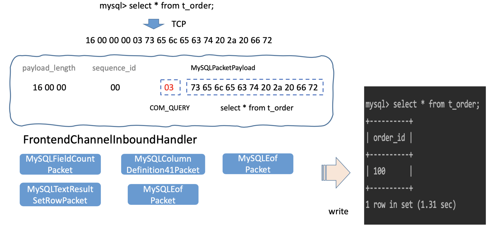

## 概览

在这个workshop中，我们会引导大家用netty去实现MySQL的[COM_QUERY](https://dev.mysql.com/doc/internals/en/com-query.html)协议;
其实在JDBC中所有statement语句在Server端都会被映射成COM_QUERY进行处理。

## 准备工作
1. 了解MySQL的COM_QUERY协议，以及[MySQL Packet](https://dev.mysql.com/doc/internals/en/mysql-packet.html)的相关知识
2. 本地安装MySQL5.7.xx (注意MySQL客户端不支持8.0）
3. 安装[Wireshark](https://www.wireshark.org/download.html)，方便抓取MySQL Packet进行分析

## 快速启动

1. mvn clean install -DskipTests
2. 启动Bootstrap.main
3. mysql -h 127.0.0.1 -P3307 -uroot -proot
4. mysql> select * from t_order;

## 任务

1. 根据COM_QUERY协议，获取客户端发起的SQL，并且打印在控制台
2. 构建COM_QUERY response所需要的Packet，并且正确返回到客户端
3. 使用ANTLR解析SQL，从内存或者文件中提取所需的结果集，正确返回到客户端（提升项）

### 代码结构

```
├── Bootstrap.java
├── fixture
└── todo  ## 在这里实现功能
    ├── FrontendChannelInboundHandler.java
    └── packet
        ├── MySQLColumnDefinition41Packet.java
        ├── MySQLEofPacket.java
        ├── MySQLFieldCountPacket.java
        └── MySQLTextResultSetRowPacket.java
```

## 实现原理


